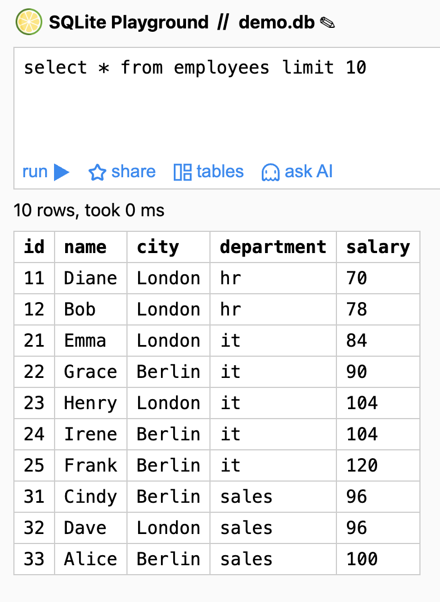

# SQLime Custom Style Chrome Extension

This Chrome extension allows you to customize the appearance of SQLime with your preferred styles.

## Screenshot

## Installation Instructions

1. Download or clone this repository to your local machine
2. Open Chrome and navigate to `chrome://extensions/`
3. Enable "Developer mode" by toggling the switch in the top-right corner
4. Click "Load unpacked" and select the directory containing this extension
5. The extension should now be installed and active

## Features

- Custom styling for SQLime interface
- Easy to modify CSS through the `override.css` file

## Development

To modify the styles:
1. Edit the `override.css` file
2. Reload the extension in Chrome by clicking the refresh icon on the extension card
3. Refresh the SQLime page to see your changes

## License

MIT License 